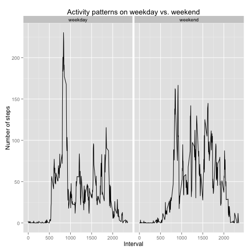

###Loading and preprocessing the data

```r
DF<-read.csv("activity.csv")
DF$date<-as.character(DF$date)
NArm<-DF[complete.cases(DF),]
```
###What is mean total number of steps taken per day?

1. Make a histogram of the total number of steps taken each day

```r
library(plyr)
total<-ddply(NArm, .(date), summarize, sum(steps))
hist(total[,2], breaks=10, xlab="Number of steps", main="Total number of steps taken each day")
```

 

2. Calculate and report the mean and median total number of steps taken per day

```r
mean<-mean(total[,2])
print(mean)
```

```
## [1] 10766.19
```

```r
median<-median(total[,2])
print(median)
```

```
## [1] 10765
```

###What is the average daily activity pattern?

1. Make a time series plot of the interval and the average number of steps taken.

```r
ave<-ddply(NArm, .(interval), summarize, mean(steps))
plot(ave$interval, ave[,2], type="l", xlab="Interval", ylab="Average number of steps")
```

 
2. Which 5-minute interval, on average across all the days in the dataset, contains the maximum number of steps?

```r
maxium<-max(ave[,2])
which(ave[,2] %in% maxium)
```

```
## [1] 104
```

```r
print(ave[104,1])
```

```
## [1] 835
```
The "835" 5-minute interval contains the maxium number of steps.

###Imputing missing values
1. Calculate and report the total number of missing values in the dataset.

```r
sum(is.na(DF$steps))
```

```
## [1] 2304
```
There are 2304 missing values.

2&3. Filling in all of the missing values in the dataset. The strategy used here is to replace a missing value by the mean for that 5-minute interval.

```r
Naindex<-which(is.na(DF$steps))
Nadays<-unique(DF[is.na(DF$steps),2])
DF2<-DF
DF2[Naindex,1]<-rep(ave[,2],length(Nadays))
```

4. Make a histogram of the total number of steps taken each day and Calculate and report the mean and median total number of steps taken per day.

```r
total2<-ddply(DF2, .(date), summarize, sum(steps))
hist(total2[,2], breaks=10, xlab="Number of steps", main="Total number of steps taken each day (NA filled)")
```

 


```r
mean<-mean(total2[,2])
print(mean)
```

```
## [1] 10766.19
```

```r
median<-median(total2[,2])
print(median)
```

```
## [1] 10766.19
```
Imputing missing values did NOT significantly change the mean/median value of the total number of steps taken per day. 

###Are there differences in activity patterns between weekdays and weekends?

1. Create a new factor variable in the dataset with two levels -- "weekday" and "weekend" 

```r
DF2$Date<-as.Date(DF2$date, "%Y-%m-%d")
DF2$Date<-weekdays(DF2$Date, abbreviate=T)
DF2[DF2$Date%in%c("Mon","Tue","Wed","Thu","Fri"),4]<-"weekday"
DF2[DF2$Date%in%c("Sat","Sun"),4]<-"weekend"
DF2$Date<-factor(DF2$Date)
```

2. Make a panel plot containing a time series plot of the 5-minute interval and the average number of steps taken, averaged across all weekday days or weekend days.

```r
ave_by<-ddply(DF2, .(Date,interval), summarize, mean(steps))
names(ave_by)<-c("Date","interval","steps")
library(ggplot2)
g<-ggplot(ave_by, aes(interval, steps))
g+geom_line()+facet_grid(.~Date)+labs(title="Activity patterns on weekday vs. weekend")+labs(x="Interval", y="Number of steps")
```

 
